# KeySharer

> A privacy-first messenger where **you** own the encryption keys — not the provider.

KeySharer is a pet project exploring true end-to-end encryption where keys **never leave your device**. You set a per-chat encryption key, messages are encrypted locally before they ever touch the network, and the server stores nothing but ciphertext. Even with full access to the database — or a compromised account — no one can read your conversations without the key, which only you and your chat partner hold.

This repository is a monorepo containing both the [`frontend/`](frontend/) (Nuxt + Tauri client) and the [`server/`](server/) (Bun + GraphQL API).

---

## The Problem

In conventional messengers your privacy depends on encryption — plain text like `"Hello World!"` becomes an unreadable string like `"=df8jfd98j3..."`. But the **keys are held by the provider**. That's what lets you log in from any device and instantly read your history — and it's also the weakness:

- The provider *can* technically read your messages.
- If your account is breached, attackers get the keys and your entire history with them.

The provider holding the keys is the single point of failure.

## The Solution — KeySharer

KeySharer removes the provider from the trust equation:

- **You control the keys.** Each chat has a "Current Key" you set yourself. It is stored **only on your device**.
- **Encryption happens on-device.** A message is encrypted locally *before* it is sent. Only someone who knows the key can decrypt it.
- **Keys are flexible.** Change a chat's key at any time. Older messages stay encrypted under the previous key.
- **The server only ever sees ciphertext.** Keys are never transmitted to the server — verifiable in your browser's dev tools.

---

## How It Works

Messages are symmetrically encrypted with **AES**, using a key derived from your chat key via **SHA-256**. The same plaintext encrypts to a *different* ciphertext on every send (randomized IV), so identical messages are indistinguishable on the wire.


> Decryption **fails** if the recipient has a different key entered. The key is the only thing that turns ciphertext back into a message — and it never leaves the device.

The same message, encrypted repeatedly with the **same key**, still produces unique ciphertext each time:

```
Hello There  ->  Zv7KTXzKLZMdhWE07OYThVhnv/4uJfzItJaPKsi8bcI=
             ->  esAJs43o7caFATZyiynYNRGhnlE+hyT999JGFDw1ENE=
             ->  rCrZxXlBUgkAkImE55Hv5fMz3UhOCS3awm2CwQ+4yfE=
             ->  ...
```

---

## Secure Key Exchange

If you control the keys, how does your chat partner get one? KeySharer offers two safe paths:

- **One-time real-time transfer.** Send a key to another user live, protected by ephemeral asymmetric keys. The exchange is **never stored on the server** and requires **both users to be online**.
- **KeyManager.** Store your keys in an encrypted local file you can import on login, so you don't have to remember them.

> Example: Mark receives a message he can't read — his chat has no idea which key encrypted it, and brute-forcing it would take a supercomputer centuries. He sends Donald an (unencrypted) request for the key; Donald transfers it securely in real time. Now only Mark and Donald can read the conversation.

---

## Features

- 🔐 **On-device encryption / decryption** — the server never sees plaintext or keys.
- 🗝️ **Per-chat keys** you set, change, or auto-generate at any time.
- 🤝 **Real-time key sharing** between online users via ephemeral asymmetric keys (not persisted).
- 📁 **File sharing, two ways** — encrypted file storage on our servers, **or** direct **P2P transfer** to online chat members (any size, never stored server-side).
- 🔎 **Transparent** — no keys are sent to the server; confirm it yourself in browser dev tools.
- 🖥️ **Cross-platform** — web today; desktop and mobile builds via Tauri with local key management.

## Trade-offs

KeySharer prioritizes privacy over convenience. Honest limitations:

- **Learning curve** — owning your keys is less frictionless than a normal messenger.
- **No conversation export** — different keys across messages make export effectively impossible.
- **Limited search** — search only works within messages sharing a single key.
- **No key recovery** — lose a key and those messages stay encrypted **forever**. There is no backdoor by design.

---

## Repository Structure

```
keysharer/
├── frontend/   # Nuxt 3 + Vue client, Tauri desktop/mobile shell
└── server/     # Bun + GraphQL Yoga API, Cassandra storage
```

> This repo was created by merging two previously separate repositories (`keysharer-frontend` and `keysharer-server`) into one monorepo with full git history preserved.

## Tech Stack

**Frontend** — Nuxt 3, Vue, Pinia, TailwindCSS, Apollo Client (GraphQL), `graphql-ws` subscriptions, Socket.IO, `crypto-js` (AES + SHA-256), Tauri 2 (desktop/mobile).

**Server** — [Bun](https://bun.sh) runtime, GraphQL Yoga, `graphql-ws`, Apache Cassandra (`cassandra-driver`), JWT auth, bcrypt, Nodemailer, `sharp` / `@napi-rs/canvas` (avatar generation), DOMPurify + `xss` sanitization, Yup validation.

---

## Getting Started

### Prerequisites

- [Bun](https://bun.sh) (`curl -fsSL https://bun.sh/install | bash`)
- Node.js (for the Nuxt frontend)
- Docker (for the Cassandra database)
- [Tauri prerequisites](https://tauri.app/start/prerequisites/) — only if building desktop/mobile

### 1. Server

```bash
cd server
cp .env-template .env        # then fill in JWT_SECRET, email creds, etc.
docker compose up -d         # start Cassandra
bun install
bun run migrate              # create keyspace / tables
bun run start                # API on http://localhost:4000
```

### 2. Frontend

```bash
cd frontend
cp .env-example .env
npm install
npm run dev                  # app on http://localhost:3000
```

### Desktop / Mobile (Tauri)

```bash
cd frontend
npm run tauri:dev            # desktop dev
npm run tauri:build          # desktop release
npm run tauri:build-android  # Android
npm run tauri:build-ios      # iOS
```

---

### 1. Start a chat

Click **New Chat**.

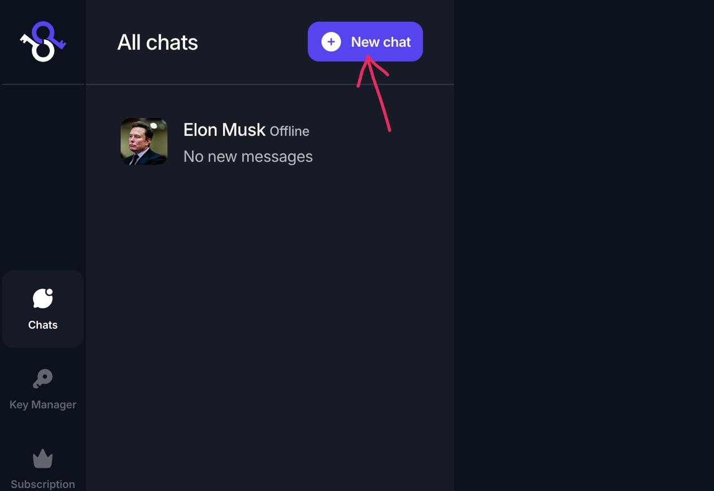

Enter the username (identifier) of the person you want to message, select them, then click **Start Chatting**.

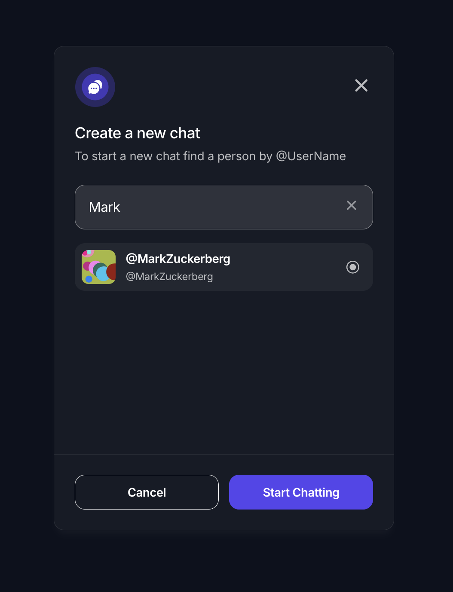

### 2. Open and manage the chat

The conversation window opens.

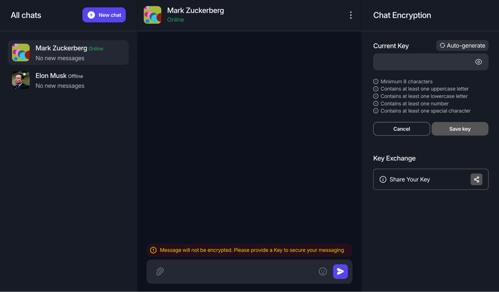

Manage the chat and its members via the **⋮ (3 dots)** in the header.

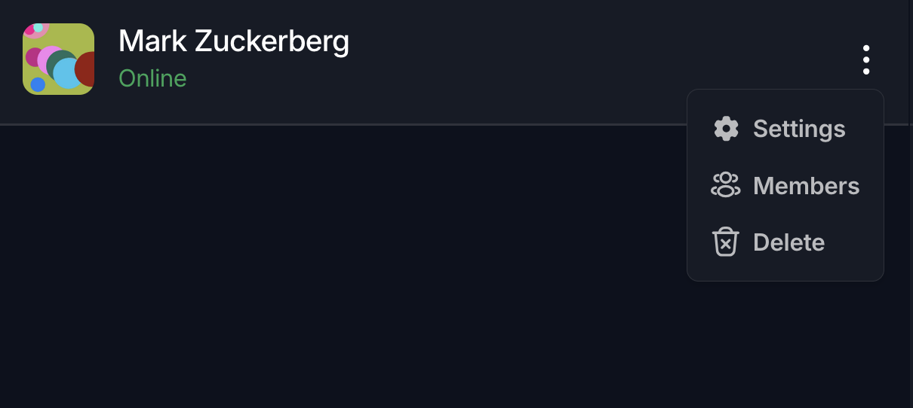

### 3. Set an encryption key

A banner above the input warns when no key is set — messages would be readable by attackers.

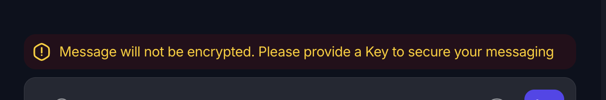

Click **Auto Generate** for a strong random key, or type your own — then click **Save Key**.

<p>
  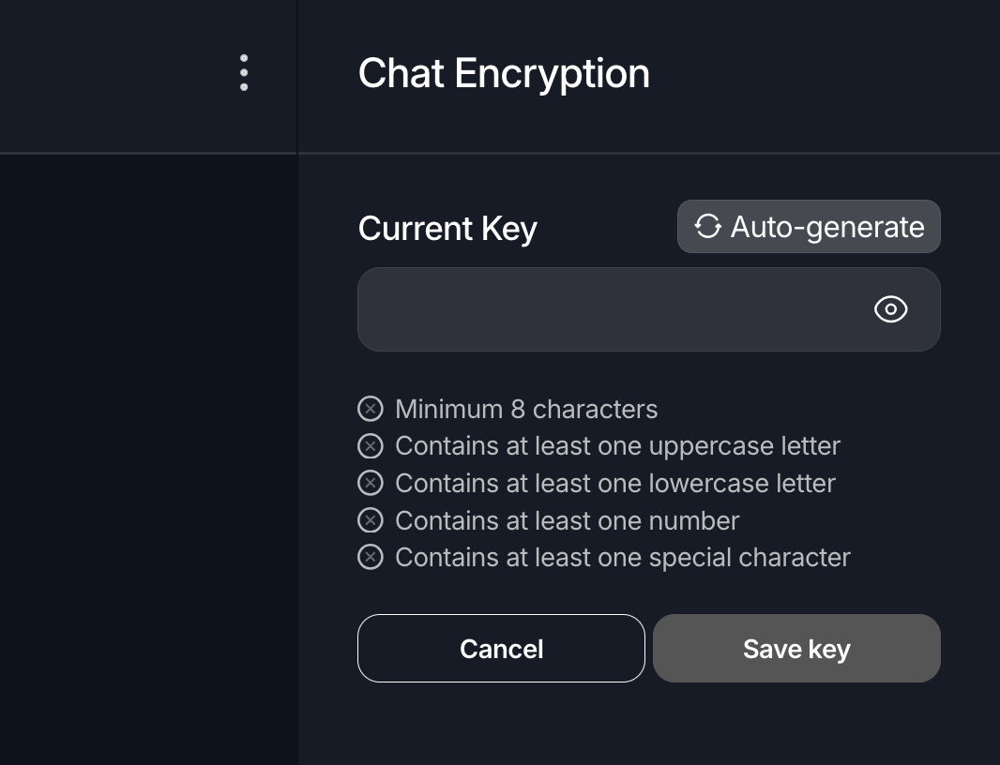
  &nbsp;➡&nbsp;
  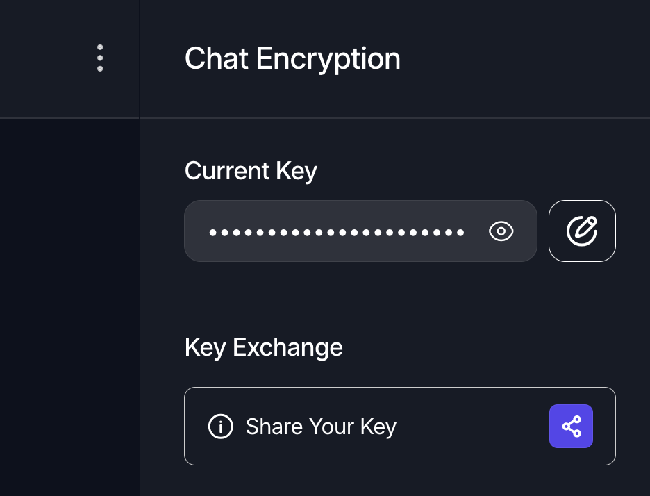
</p>

### 4. Message securely

Messages are now encrypted on your device. Your partner can only read them if they have the **same key**.

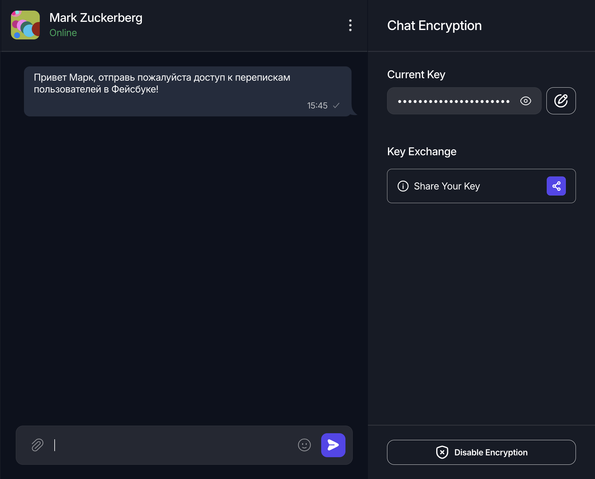

This is what a recipient **without the key** sees — only ciphertext, unreadable:

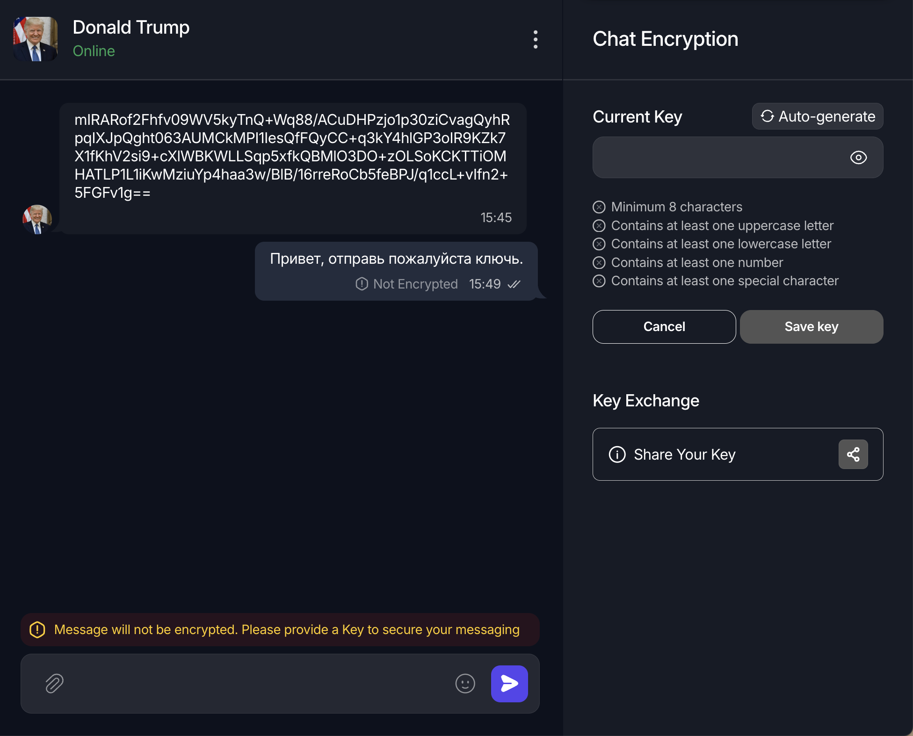

### 5. Share the key

If your partner doesn't have the key, use KeySharer's real-time key exchange (both users must be online) to deliver it safely — without it ever touching the server.

<p>
  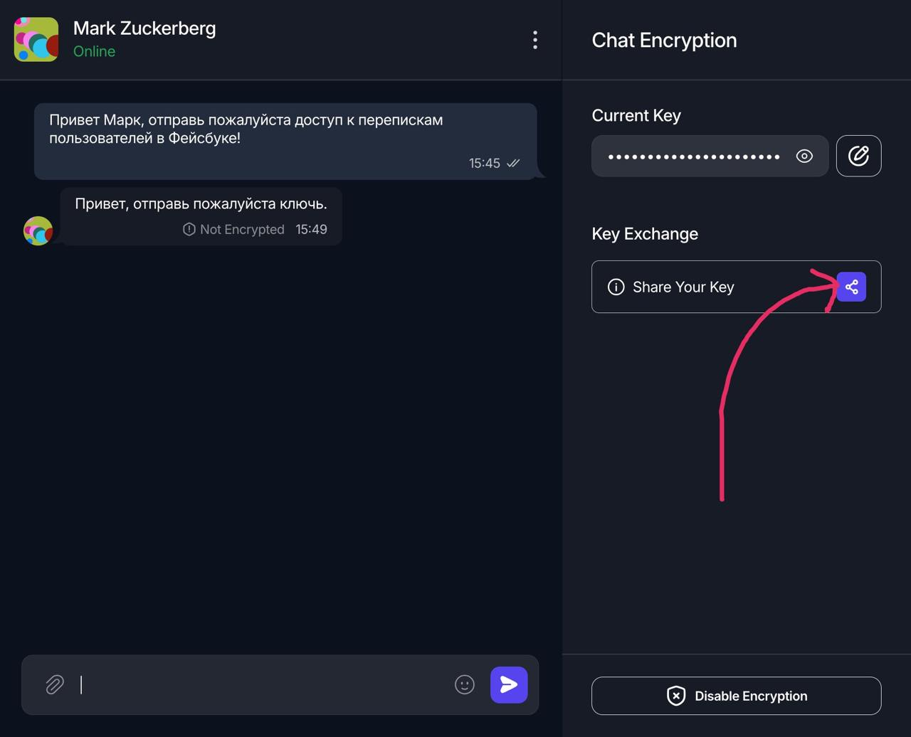
  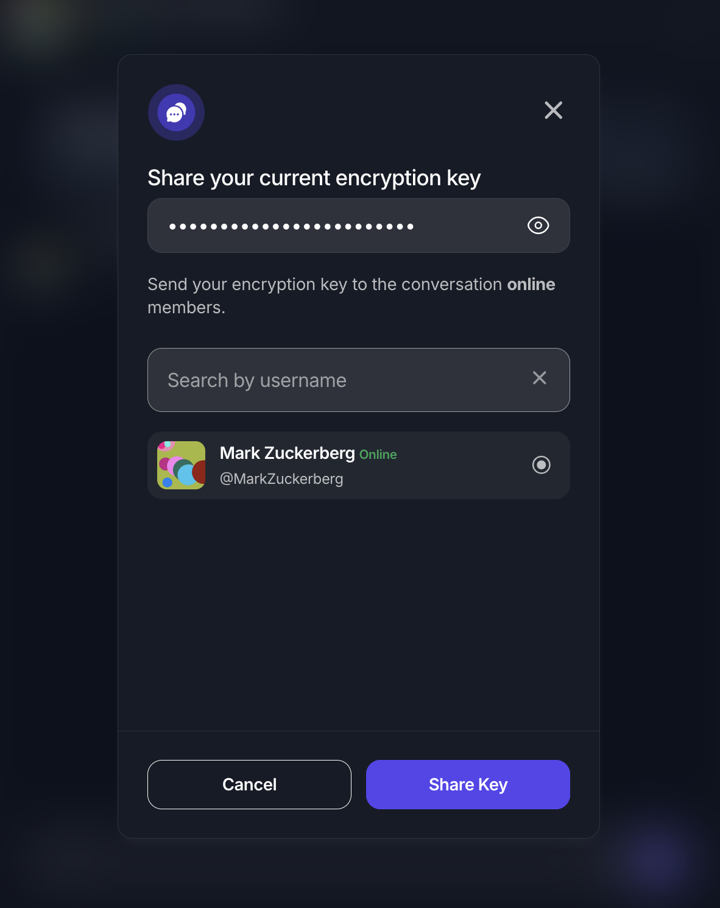
  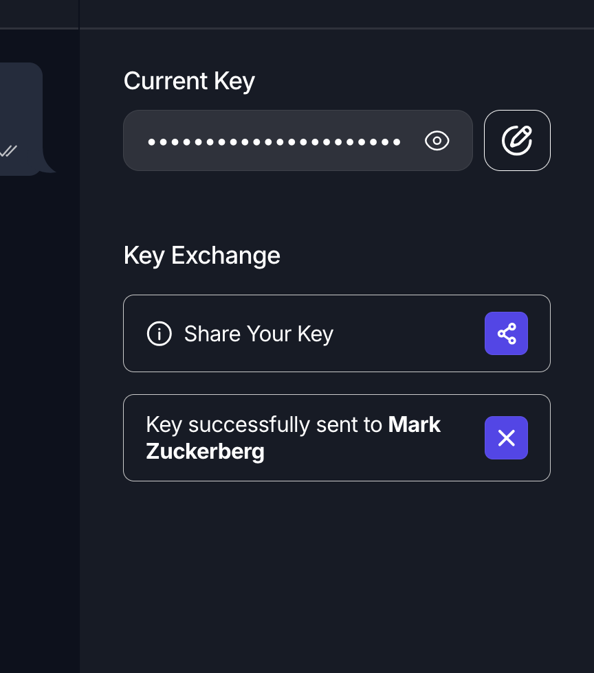
</p>

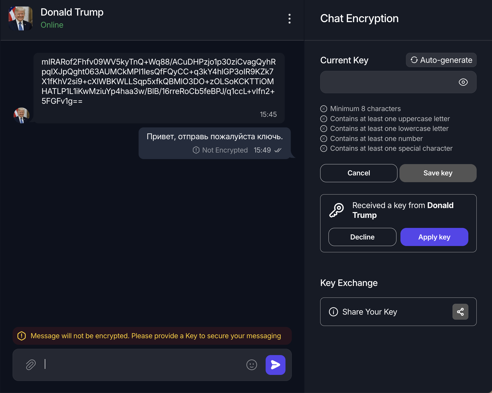

---

## Security Notes

- Encryption and decryption happen entirely client-side; the server stores **only ciphertext** and never receives keys.
- Keys live on your device (and optionally in the encrypted KeyManager file). **There is no recovery** — this is intentional.
- Real-time key transfers use ephemeral asymmetric keys and are not persisted anywhere.

## Status

KeySharer is a **personal pet project / proof of concept** demonstrating provider-independent end-to-end encryption. Desktop and mobile releases with local key management are planned.
